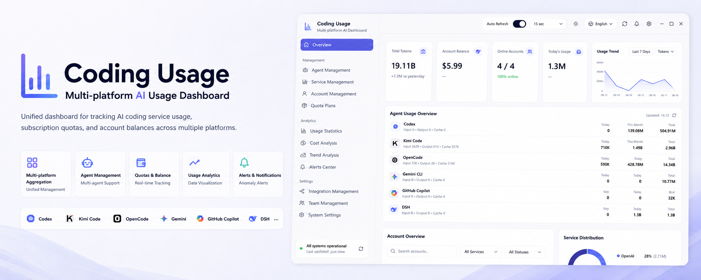

<p align="center">
  
</p>

<h1 align="center">Coding Usage · Multi-Platform AI Usage Dashboard</h1>

<p align="center"><a href="./README.md">中文</a> | English</p>

<p align="center">A Windows desktop app that unifies <strong>real local AI coding-tool usage</strong> with <strong>provider plan quotas, account balances and official subscription limits</strong>.</p>

<p align="center">Fully local · No backend · No tracking · Keys encrypted via the OS keyring, never uploaded</p>

<p align="center">
  
  
  
  
  <a href="./LICENSE"></a>
</p>

---

## What it does

- **Real local agent usage**: [tokscale](https://github.com/junhoyeo/tokscale) scans local session logs covering 20 mainstream tools — Codex, Claude Code, Kimi Code, OpenCode, Gemini CLI, Cursor, GitHub Copilot, Qwen Code, Trae, Cline, Roo Code and more. Only tools with data are listed; today / month / all-time columns with an "as of" timestamp. Aggregate numbers only — message content never leaves your machine
- **Provider plans & balances**: multi-account management for 10 providers (table below), each with its own official-endpoint adapter; balances aggregate into the display currency, with a hover breakdown when several pay-as-you-go providers coexist
- **Official subscription quotas**: three cards for Codex (ChatGPT login), Claude Code and Gemini CLI read only the local login state, showing 5-hour / weekly / per-model windows with reset countdowns — credentials stay inside the main process, never reaching the renderer or disk
- **Alerts**: window-reset, high-usage and low-balance rules with adjustable thresholds in the alerts center; hover the top-bar bell for a preview (opening marks them read), with a full alerts center; pushable to WeCom group robots, WeChat (iLink), Feishu / Lark and Telegram
- **Desktop experience**: tray-resident, close dialog (minimize to tray or quit), launch on login, light/dark/system themes, zh-CN/en-US locales, auto-update via GitHub Releases

## Supported Providers

| Provider | Type | Description |
|---|---|---|
| **OpenCode Zen Go** | Plan quota | 5h rolling / weekly / monthly windows |
| **Z.ai (Zhipu GLM)** | Plan quota | 5h / weekly windows + MCP monthly calls; China + International |
| **MiniMax Token Plan** | Plan quota | 5h / weekly quota + video bonus; China + International |
| **Volcengine Ark** | Plan quota | Coding Plan windows; AK/SK request signing |
| **Kimi / Moonshot** | Account balance | Cash + vouchers; CNY (China) / USD (International) |
| **DeepSeek** | Account balance | Multi-currency (CNY / USD), topped-up + granted |
| **SiliconFlow** | Account balance | `.cn` CNY / `.com` USD |
| **OpenRouter** | Account balance | Remaining = total credits − usage (USD) |
| **StepFun** | Account balance | Account balance (CNY) |
| **Novita** | Account balance | Available balance (USD) |

## Privacy & Security Boundaries

- Everything (keys, snapshots, scan results) stays local: localStorage + safeStorage encryption (`enc:v3:`) + a userData file mirror; v1→v2→v3 migration is automatic
- The renderer runs inside the Chromium sandbox with a strict CSP; all outbound requests go through the main process `net.fetch` straight to official endpoints — **no third-party proxy involved**
- The local agent scan only produces aggregates (tokens, cost estimates, message counts); raw session content never leaves the machine
- Unsigned builds trigger a Windows SmartScreen warning — the Authenticode hookup is prepared (`electron-builder.yml` and the release workflow); configure `WIN_CSC_LINK` secrets once a certificate is purchased

## Download & Install

Grab a build from [Releases](https://github.com/JochenYang/Coding-Usage/releases):

- **Windows**: NSIS installer or portable build. Unsigned builds trigger SmartScreen — click "More info" → "Run anyway"
- **macOS** (Apple Silicon / Intel): currently unsigned — on first launch **right-click the App → Open**, or run `xattr -cr "/Applications/Coding Usage.app"` to drop the quarantine flag; it opens normally afterwards
- **Linux** (x64): `chmod +x Coding-Usage-*.AppImage` and run — no installation needed

## Quick Start

Node.js 22+ required.

```bash
npm install
npm run dev        # Electron desktop app (electron-vite dev, HMR)
npm run dev:web    # Renderer only (http://localhost:5173, desktop features degrade to empty states)
npm run build      # Full build (dist/ + dist-electron/)
npm run dist:win   # Package Windows installers (NSIS + portable)
```

## Releasing

Push a `v*` tag (e.g. `v0.1.0`) to trigger the release workflow: a draft release is created → Windows build (tsc → build → electron-builder `--publish always`) → bilingual release notes generated from `CHANGELOG.md` into the draft; review and publish manually. Maintain changes in `CHANGELOG.md` (`### 中文` / `### English` entries kept one-to-one); preview locally with `node scripts/gen-release-notes.mjs v0.1.0`.

## Adding a New Provider

1. Create an adapter in `src/providers/` implementing `ProviderDef` (`buildRequest` + `parseResponse`)
2. Register it in `src/providers/registry.ts` and add i18n keys in all three `src/i18n/` files
3. Under Electron the main process connects directly (no proxy); browser mode is covered by `src/lib/query.ts`
4. Brand icons come from `@lobehub/icons` (register the slug in `src/components/ProviderLogo.tsx`)

## Tech Stack

| Layer | Tech |
|---|---|
| **Framework** | React 19 + Vite 7 |
| **Desktop** | Electron 44 (electron-vite + electron-builder + electron-updater) |
| **Language** | TypeScript 5 strict |
| **Styling** | Tailwind CSS v4 (`@theme` token driven) |
| **Animation** | `motion/react` + beui.dev |
| **Icons** | `lucide-react` + `@lobehub/icons` (bundled offline) |
| **Local scan** | tokscale 4.14 (platform binary as optional dependency) |
| **State** | React hooks + `localStorage` (no state library) |

## License

[MIT](./LICENSE)
