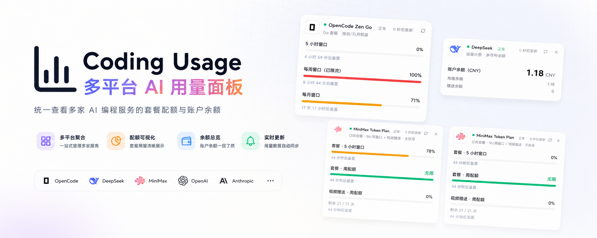

<p align="center">
  
</p>

<h1 align="center">Coding Usage · 多平台 AI 用量面板</h1>

<p align="center"><a href="./README.en-US.md">English</a> | 中文</p>

<p align="center">一个 Windows 桌面应用，统一查看<strong>本地 AI 编程工具的真实用量</strong>与<strong>各家服务商的套餐配额、账户余额、官方订阅额度</strong>。</p>

<p align="center">纯本地 · 无后端 · 无追踪 · 密钥经系统密钥环加密，永不上传</p>

<p align="center">
  
  
  
  
  <a href="./LICENSE"></a>
</p>

---

## 它能做什么

- **本地 Agent 真实用量**：经 [tokscale](https://github.com/junhoyeo/tokscale) 扫描本机会话日志，覆盖 Codex、Claude Code、Kimi Code、OpenCode、Gemini CLI、Cursor、GitHub Copilot、Qwen Code、Trae、Cline、Roo Code 等 20 种主流工具——只显示检测到数据的工具，今日 / 本月 / 累计三栏 + 「数据截至」时间标注；仅聚合数字上屏，永远不读取消息内容
- **服务商套餐与余额**：多账号管理 10 家服务商（见下表），每家独立适配官方端点；余额按显示币种聚合，多家并存时悬停可看逐家明细
- **官方订阅额度**：Codex（ChatGPT 登录）、Claude Code、Gemini CLI 三张订阅卡只读本机登录态，展示 5 小时 / 每周 / 逐模型配额窗口与重置倒计时——凭据始终留在主进程内存，不进渲染层、不落磁盘
- **告警体系**：窗口即将重置、用量过高、低余额三类规则，阈值在告警中心可调；顶栏铃铛悬停预览（打开即视为已读），告警中心集中管理；可推送到企业微信群机器人、微信（iLink）、飞书 / Lark、Telegram
- **桌面体验**：托盘常驻、关窗可选「最小化到托盘 / 退出」、开机自启、深浅色主题（跟随系统）、中英双语、自动更新（GitHub Releases）

## 支持的 Provider

| Provider | 类型 | 说明 |
|---|---|---|
| **OpenCode Zen Go** | 套餐配额 | 5h 滚动 / 每周 / 每月窗口 |
| **Z.ai（智谱 GLM）** | 套餐配额 | 5h / 每周窗口 + MCP 月度次数；国内 + 国际站 |
| **MiniMax Token Plan** | 套餐配额 | 5h / 周配额 + 视频赠送额度；国内 + 国际 |
| **火山方舟 Ark** | 套餐配额 | Coding Plan 窗口；AK/SK 请求签名 |
| **Kimi / Moonshot** | 账户余额 | 现金 + 代金券；国内站 CNY / 国际站 USD |
| **DeepSeek** | 账户余额 | 多币种（CNY / USD），区分充值与赠送 |
| **SiliconFlow 硅基流动** | 账户余额 | `.cn` CNY / `.com` USD 双站 |
| **OpenRouter** | 账户余额 | 剩余 = 累计充值 − 已用（USD） |
| **StepFun** | 账户余额 | 账户余额（CNY） |
| **Novita** | 账户余额 | 可用余额（USD） |

## 隐私与安全边界

- 所有数据（密钥、快照、扫描结果）只存本机：localStorage + safeStorage 加密（`enc:v3:`）+ userData 文件备份镜像；带 v1→v2→v3 自动迁移
- 渲染进程运行在 Chromium 沙箱中并加载严格 CSP；所有对外请求经主进程 `net.fetch` 直连官方端点，**不经过任何第三方代理**
- 本地 Agent 扫描只输出聚合数字（token 数、成本估算、消息数），会话原文永不离开本机
- 未签名的构建会被 Windows SmartScreen 提示——Authenticode 签名接入点已预留（`electron-builder.yml` 与 release workflow），购证后配置 `WIN_CSC_LINK` 等 secrets 即可

## 下载与安装

从 [Releases](https://github.com/JochenYang/Coding-Usage/releases) 获取：

- **Windows**：NSIS 安装版或便携版。未签名构建会触发 SmartScreen——点「更多信息」→「仍要运行」
- **macOS**（Apple Silicon / Intel 双架构）：当前为未签名构建，首次打开请**右键 App → 「打开」**，或执行 `xattr -cr "/Applications/Coding Usage.app"` 移除隔离属性，之后正常启动
- **Linux**（x64）：下载 AppImage 后 `chmod +x Coding-Usage-*.AppImage` 直接运行，无需安装

## 快速开始

需要 Node.js 22+。

```bash
npm install
npm run dev        # Electron 桌面应用（electron-vite dev，HMR）
npm run dev:web    # 仅浏览器渲染层（http://localhost:5173，桌面能力降级为空态）
npm run build      # 全量构建（dist/ + dist-electron/）
npm run dist:win   # 打包 Windows 安装包（NSIS + portable）
```

## 发布

推 `v*` tag（如 `v0.1.0`）触发 release workflow：预建 draft release → Windows 构建（tsc → build → electron-builder `--publish always`）→ 从 `CHANGELOG.md` 生成双语 release notes 写入草稿，人工核对后发布。变更记录在 `CHANGELOG.md` 维护（`### 中文` / `### English` 条目一一对应），本地可用 `node scripts/gen-release-notes.mjs v0.1.0` 预览。

## 新增 Provider

1. 在 `src/providers/` 新建 adapter，实现 `ProviderDef`（`buildRequest` + `parseResponse`）
2. 在 `src/providers/registry.ts` 注册，`src/i18n/` 三处补文案键
3. Electron 下主进程直连无需代理；浏览器模式由 `src/lib/query.ts` 兜底
4. 品牌图标用 `@lobehub/icons`（`src/components/ProviderLogo.tsx` 注册 slug）

## 技术栈

| 层 | 技术 |
|---|---|
| **框架** | React 19 + Vite 7 |
| **桌面** | Electron 44（electron-vite + electron-builder + electron-updater） |
| **语言** | TypeScript 5 strict |
| **样式** | Tailwind CSS v4（`@theme` token 驱动） |
| **动画** | `motion/react` + beui.dev |
| **图标** | `lucide-react` + `@lobehub/icons`（离线打包） |
| **本地扫描** | tokscale 4.14（平台二进制可选依赖） |
| **状态** | React hooks + `localStorage`（无状态库） |

## License

[MIT](./LICENSE)
