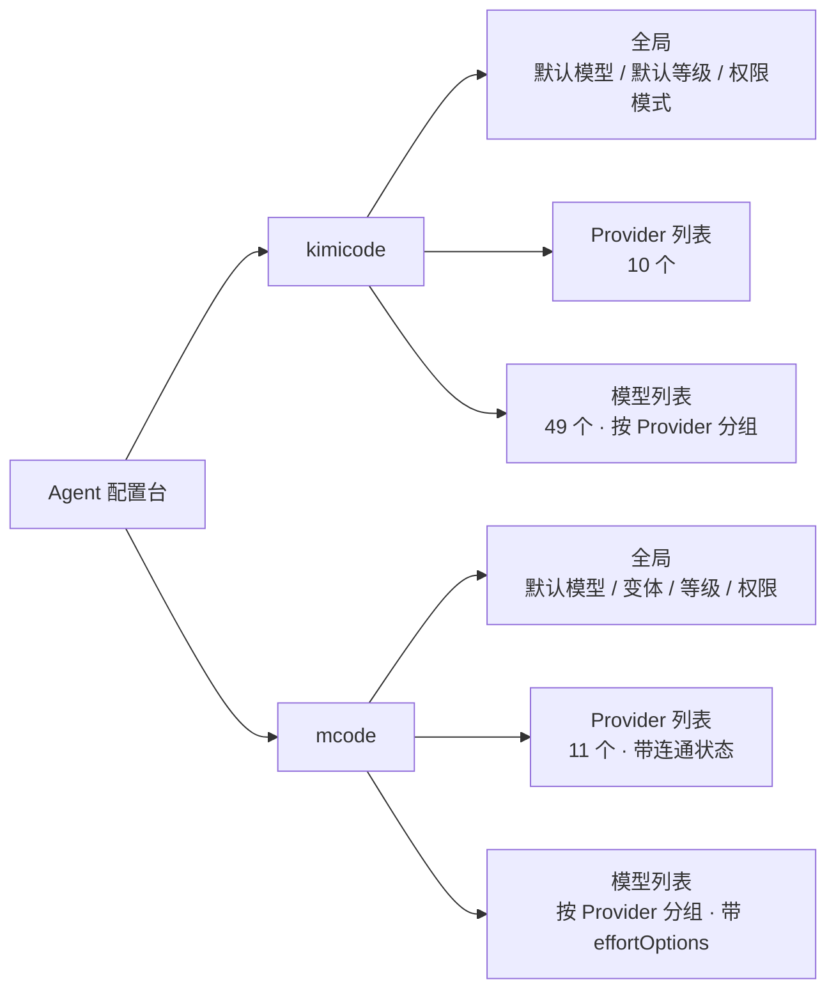
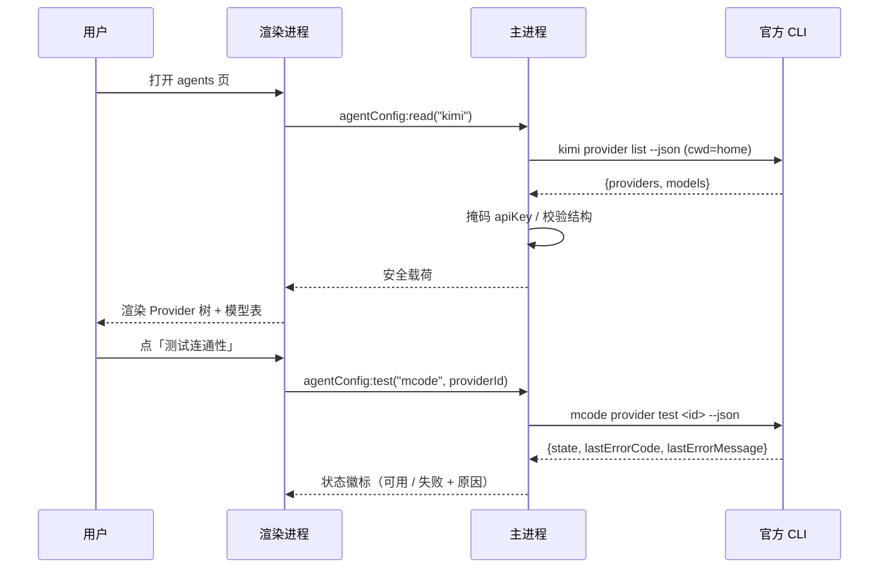
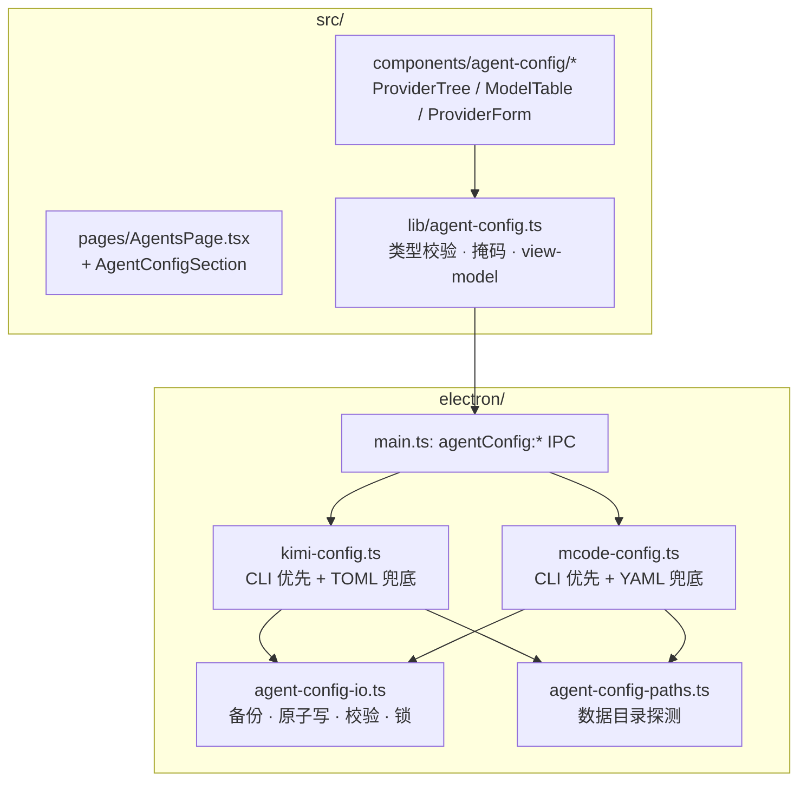

# Agent 配置功能 — 调研报告与实现方案

> 目标：在 `coding-usage` 中新增「Agent 配置」能力，用于查看与修改本机两个编码 Agent 的模型/Provider/推理等级配置：
> - **kimicode**（Kimi Code CLI）→ `~/.kimi-code/config.toml`
> - **mcode**（MiniMax Code）→ `~/.minimax/config.yaml`
>
> 本文回答两个问题：**功能怎么展现**、**要暴露哪些配置参数**，并给出可执行的技术方案。

---

## 0. 结论摘要

| 问题 | 结论 |
| --- | --- |
| 展现方式 | 在现有 `agents` 页面下方新增「Agent 配置」分区，进入后是一个**双栏配置台**：左侧 Agent/Provider 树，右侧 Provider/模型/全局设置详情。不做独立页面，因为 agents 页已经承载「本机 Agent」的心智模型。 |
| 首选集成面 | **优先调用两边官方 CLI 的 `--json` 输出与子命令**，而不是自己解析配置文件。读取用 `provider list --json`（密钥已由官方掩码），写入用 `provider add/remove`。文件读写只作为兜底与顶层设置补充。 |
| 配置参数分三层 | ① Agent 全局（默认模型、默认推理等级、权限模式）② Provider（名称、base URL、协议类型、密钥状态）③ Model（模型 ID、显示名、上下文/输出上限、能力位、推理等级档位与默认档）。 |
| 最大风险 | 两个配置文件都**明文存放 API Key**；GUI 必须做到「读不回显、写不落日志、改前备份、改后校验」。 |
| 工作量 | P0 只读总览 + 单 Provider 增删 ≈ 3 个主进程模块 + 1 个页面；P1 才做模型级参数编辑。 |
| 需要用户确认 | 见第 8 章（4 个决策点）。 |

---

## 1. 实测环境与对象

以下全部为本机实测结果（L1 证据：可直接复现的命令与文件读取），非文档推断。

| 项 | kimicode | mcode |
| --- | --- | --- |
| CLI 入口 | `C:\Users\Administrator\.kimi-code\bin\kimi.exe` | `C:\Users\Administrator\.minimax-code\mcode.cmd` |
| npm 包 | — | `@minimax-ai/code@0.4.12` |
| 程序目录 | `~/.kimi-code` | `~/.minimax-code`（npm prefix，含 `releases/0.4.12` 与自带 node runtime） |
| **数据/配置目录** | `~/.kimi-code` | **`~/.minimax`** |
| 配置文件 | `~/.kimi-code/config.toml`（590 行） | `~/.minimax/config.yaml`（1154 行） |
| 目录覆盖变量 | `KIMI_CODE_HOME` | `MINIMAX_DATA_DIR` |
| 日志目录 | `~/.kimi-code/logs/` | `~/.minimax/v2/observability/logs/` |
| 会话存储 | `~/.kimi-code/sessions/` | `~/.minimax/v2/sessions/` + `~/.minimax/sqlite.db` |
| 当前规模 | 10 个 Provider / 49 个模型 | 11 个 Provider 条目 / 30+ 模型 |

### 1.1 一个必须记住的路径陷阱

`~/.minimax-code` 与 `~/.minimax` **是两个不同目录，名字相近但职责相反**：

- `~/.minimax-code` = npm 全局安装前缀（程序、`releases/<ver>`、`current` 指针、内置 Node）。里面**没有** `config.yaml`。
- `~/.minimax` = 运行时数据目录（`config.yaml`、会话、sqlite、skills、agents、mcp.json 全在这里）。

已安装的 0.4.12 包内默认数据目录常量是 `.minimax`（实测：`releases/0.4.12/node_modules/@minimax-ai/code/chunks/chunk-CYA33574.js` 中唯一匹配 `".minimax"`）。

**但这个默认值正在被上游改掉**：`D:\codes\minimax-code` 源码里 `packages/tui/src/runtime/data-dir.ts:21` 的 `resolveDefaultTuiDataDir()` 已经返回 `join(homedir(), '.minimax-code')`，而 `packages/config/src/config.ts:1197` 仍是 `APP_DIR: ".minimax"` —— 两个包尚未对齐，说明迁移进行中。**下一次升级 mcode 后，配置文件很可能出现在 `~/.minimax-code/config.yaml`。**

因此 GUI 定位配置文件不能硬编码单一路径，顺序应为：

1. 读环境变量 `MINIMAX_DATA_DIR`（用户级/机器级也要看，不只当前进程）
2. 否则探测 `~/.minimax/config.yaml`
3. 再兜底探测 `~/.minimax-code/config.yaml`（源码版默认值，本机不存在）
4. 以「文件是否存在」为最终判据，两个都无 → 显示未安装/未初始化

**CLI 入口探测要避开失效包装器**：`~/.minimax/bin/minimax.cmd` 与 `mavis.cmd` 内容完全相同，都指向 `D:\Program Files (x86)\MiniMax Code\...\daemon\cli.js` —— 该路径在本机**已不存在**，是残留物。真正可用的入口是 `~/.minimax-code/mcode.cmd`（或 `mcode.ps1`，经 `current` 指针解析到 `releases/0.4.12`）。kimicode 侧入口是 `~/.kimi-code/bin/kimi.exe`。

---

## 2. 关键发现

### 2.1 两边都提供官方非交互 CLI —— 这是首选集成面

**mcode**（实测 `mcode provider --help`）：

```
mcode provider list [--json]                              # 列出 provider，含掩码密钥与连通状态
mcode provider add --name <n> --base-url <u> \
      --api-format <anthropic-messages|openai-completions|openai-responses> \
      --model <id>（可重复） --api-key-env <ENV> [--use]
mcode provider test <provider-id> [--model <id>] [--json]
mcode provider remove <provider-id> --yes
mcode provider use token-plan|api-key
mcode provider set-minimax-key --api-key-env <ENV>
```

**kimi**（实测 `kimi provider --help`、`kimi doctor --help`）：

```
kimi provider list [--json]                 # 输出结构化 providers + models
kimi provider add <url> [--api-key <k>]     # 从自定义 registry（api.json）批量导入
kimi provider remove <providerId>
kimi provider catalog list|add              # 从 models.dev 公共目录发现并导入
kimi doctor config [path]                   # 校验 config.toml，exit 0 = 通过
```

`mcode provider list --json` 的实测输出结构（**密钥已由官方掩码，明文不出现**）：

```jsonc
{
  "providerId": "custom_provider:deepseek",
  "name": "deepseek",
  "kind": "custom",              // custom | oauth
  "active": false, "enabled": true, "readOnly": false,
  "configRevision": "sha256:f506…122b",   // 配置指纹，可用于并发冲突检测
  "apiFormat": "openai-completions",
  "baseUrl": "https://api.deepseek.com",
  "hasApiKey": true,
  "maskedApiKey": "sk-e****278e",
  "models": [{ "modelId": "deepseek-flash", "displayName": "DeepSeek V4 Flash",
               "selected": false,
               "status": { "state": "failed", "lastTestedAt": 1789810323506,
                           "lastErrorCode": "http_402",
                           "lastErrorMessage": "Think Effort \"high\": HTTP 402: Insufficient Balance; …" } }],
  "status": { "state": "failed", "lastErrorCode": "http_402", … }
}
```

`kimi provider list --json` 的实测输出结构（**`providers.<name>.apiKey` 是明文，必须由 GUI 掩码**）：

```jsonc
{
  "providers": { "opencode-go": { "baseUrl": "…", "type": "openai", "apiKey": "<明文>" } },
  "models": {
    "opencode-go/kimi-k3": {
      "provider": "opencode-go", "model": "kimi-k3",
      "maxContextSize": 1048576, "maxOutputSize": 131072, "maxInputSize": 922000, // maxInputSize 可选
      "capabilities": ["image_in", "video_in", "always_thinking", "tool_use"],
      "displayName": "Kimi K3", "reasoningKey": "reasoning_content",
      "supportEfforts": ["max"], "defaultEffort": "xhigh", "offEffort": "none",
      "protocol": "anthropic", "baseUrl": "…", "overrides": {}
    }
  }
}
```

模型字段实测全量（跨 49 个模型去重）：`baseUrl, capabilities, defaultEffort, displayName, maxContextSize, maxInputSize, maxOutputSize, model, offEffort, overrides, protocol, provider, reasoningKey, supportEfforts` —— **与 config.toml 的 snake_case 字段一一对应**，可直接作为 GUI 的数据模型。

### 2.2 kimi 额外提供本地 REST server —— 更完整的配置 API

`kimi web` 会在前台起一个本地服务（REST + WebSocket + Web UI），源码证据：

| 项 | 值 | 来源 |
| --- | --- | --- |
| 默认 host / port | `127.0.0.1` / **58627** | `packages/kap-server/src/../sub/web/shared.ts:12-15` |
| 鉴权 | `Authorization: Bearer <token>`，仅 `/api/v1/healthz` 免鉴权 | `packages/kap-server/src/middleware/auth.ts:40` |
| token 位置 | `<KIMI_CODE_HOME>/server.token`（0600，首次启动写入） | `apps/kimi-code/src/cli/sub/web/shared.ts:19,140` |
| 轮换 | `kimi web rotate-token` | `apps/kimi-code/src/cli/sub/web/rotate-token.ts` |
| 配置读 | `GET /api/v1/config` —— *Get the global Kimi configuration (**secrets redacted**)* | `packages/kap-server/src/routes/config.ts:37` |
| 配置写 | `POST /api/v1/config` —— merge 语义，`yolo:true` 会转成 `default_permission_mode:"yolo"` | `packages/kap-server/src/routes/config.ts:57,65` |
| 模型目录 | `/api/v1/modelCatalog/*`（provider 增删改、catalog 导入、模型刷新、默认模型设置） | `packages/kap-server/src/routes/modelCatalog.ts` |

`GET /config` 返回的 `providers` 只给 `{type, base_url, default_model, api_key_env, has_api_key}` —— **布尔位而非密钥**；`models` 条目也剥掉了 `apiKey`/`oauth`，换成 `has_api_key`。这是所有候选路线里密钥安全性最好的一个。

**本机实测状态**：`server.token` 存在（43 字符，说明曾启动过），但 `127.0.0.1:58627` 当前无监听 —— 即 REST 路线需要由 GUI 或用户先把 server 拉起来。

### 2.3 mcode 的状态与配置是分开存的

| 文件 | 内容 | 说明 |
| --- | --- | --- |
| `~/.minimax/config.yaml` | provider / 模型 / 默认模型 / 权限模式 | 用户可手改，无注释 |
| `~/.minimax/model-cache.json` | `provider_status` / `model_status`：`state`(available\|failed)、`last_tested_at`、`last_error_code`、`last_error_message`、**`config_fingerprint`(sha256)** | 由 `provider test` 写入；指纹联动配置内容，配置一改状态即失效 |
| `~/.minimax/permission.json` | `allow` / `deny` / `ask` 三条命令权限表 | 与本功能的「权限模式」不同，是命令级白名单 |
| `~/.minimax/tui-settings.json` | `{ "tuiMode": "regular" }` | |
| `~/.minimax/mcp.json` | `mcpServers` | MCP 不在 config.yaml 里 |
| `~/.minimax/skills/`、`agents/`、`plugins/` | 用户级扩展 | 目录扫描发现，无 install 概念 |

`config.yaml` 的字段空间远大于当前使用量：包内 `configs/data-minimal.yaml` 还展示了 `agents`、`memory`、`askUser`、`skills`、`skillEvolve`、`beta`（20 个开关）等段落，本机配置里一个都没用到。

### 2.4 与既有报告 `minimax-code-report.html` 的三处冲突（重要）

用户的 `D:\codes\minimax-code-report.html`（标题：《MiniMax Code 源码探索与第三方模型 / 推理等级 / Kimi 配置移植指南》，基于源码仓库 `D:\codes\minimax-code @ e3724a1` 的静态阅读，L2）与本机实测存在三处不一致。**方案一律以实测为准**：

| # | 报告说法（对应源码 `e3724a1`） | 已发布 0.4.12 实测 | 结论 |
| --- | --- | --- | --- |
| 1 | 数据目录默认 `~/.minimax-code`，配置在 `~/.minimax-code/config.yaml` | 数据目录是 `~/.minimax`；`~/.minimax-code` 目前只是 npm 安装前缀，其中无 config.yaml | **不是报告写错，而是上游正在迁移**：`packages/tui/src/runtime/data-dir.ts:21` 已改指 `~/.minimax-code`，`packages/config/src/config.ts:1197` 尚未跟上。→ 双路径探测 + 读环境变量，见 1.1 |
| 2 | `mcode provider add` 支持 `--context-limit` / `--output-limit` | 已安装的 0.4.12 包**没有**这两个参数（help 仅 6 个选项） | 源码 `packages/tui/src/cli/program.ts:195-196` 已添加但未发布。**不能依赖**：GUI 必须按「探测到的实际参数」决定是否启用，或直接走文件路线 |
| 3 | 用户级扩展目录为 `~/.minimax-code/skills`、`agents`、`mcp.json` | 实测均在 `~/.minimax/` 下 | 同迁移问题，与本功能无关但影响后续扩展 |

报告自身在 5.2 节已声明「已安装的 npm 包版本与源码树在行为上不保证逐字一致」——第 2、3 条正是这句话的实例。

**由此得出一条工程要求**：本功能对 mcode 的所有 CLI 能力探测都必须是**运行时特性探测**（先跑 `--help` 判断参数是否存在），而不是按版本号硬编码分支。

这一条已经实测坐实：`D:\codes\minimax-code`（HEAD `e3724a1`，声明版本 **0.4.12**）的 `packages/tui/src/cli/program.ts:195-196` 有 `--context-limit` / `--output-limit`，而已安装的**同为 0.4.12** 的 npm 包，其打包产物（`chunks/*.js` + `cli.js`）中这两个字符串**零命中**。

→ 推论：**源码仓库不能当作「已安装版本行为」的依据**，它只代表下一个版本。凡是要写进 GUI 的能力，一律以 `--help` 实跑探测为准。

报告仍然有效的部分（可作为本功能的领域知识）：三条配置路径、`options.baseURL`/`api`/`limit.context` 等磁盘字段名、thinking 变体与 `thinking_config.mode` 的四种取值、三家协议的请求字段映射（`reasoning_effort` / `reasoning.effort` / `output_config.effort`）、以及"等级合法性由模型自己的 `effortOptions` 决定"这一核心语义。

### 2.5 密钥现状

| 位置 | 形态 | 结论 |
| --- | --- | --- |
| `~/.kimi-code/config.toml` | 明文（`api_key = "sk-…"`、`eyJ…` JWT） | GUI 读到必须立即掩码，不落日志、不进 IPC 之外的存储 |
| `~/.minimax/config.yaml` | 明文（`options.apiKey`） | 同上 |
| `kimi provider list --human` | 只显示 `type` / 模型数 / source，不显示密钥 | 人类可读输出可安全用于日志 |
| `kimi provider list --json` | **含明文 apiKey** | GUI 调用后必须自行掩码再落任何缓存 |
| `mcode provider list --json` | 只给 `maskedApiKey` + `hasApiKey` | 可直接使用 |

`mcode provider add` 刻意**不提供** `--api-key` 直传，只接受 `--api-key-env <ENV>`；密钥经环境变量传入子进程后由 CLI 写入文件。GUI 应沿用这一模式（spawn 时注入 env），而不是拼命令行参数。

---

## 3. 配置参数清单（回答「配置参数包含哪些」）

按三层组织。**「建议」列**是本方案对该字段在产品里的呈现取舍：`编辑` = 提供表单；`只读` = 仅展示；`高级` = 折叠在「高级」区，需要显式展开；`不做` = 本期不纳入。

### 3.1 kimicode — `config.toml`

#### A. 顶层与全局段

| 段落 / 键 | 类型 | 取值 | 建议 | 说明 |
| --- | --- | --- | --- | --- |
| `default_model` | string | `"<provider>/<model>"` | 编辑 | 默认模型；引用不存在的 key 会导致会话启动告警 |
| `default_provider` | string | provider 名 | 编辑 | 默认 Provider |
| `default_permission_mode` | enum | `manual` \| `auto` \| `yolo` | 编辑 | 源码 `packages/agent-core-v2/src/agent/permissionMode/configSection.ts:7` |
| `[thinking]` `.enabled` | bool | true/false | 编辑 | 全局思考开关 |
| `[thinking]` `.effort` | enum | 见 3.3 | 编辑 | 全局推理等级 |
| `[model_overrides]` `.max_completion_tokens` | int | 正整数 | 高级 | 全局补全 token 上限 |
| `[experimental]` `.*` | bool 映射 | `auto_session_title` / `remote-control` / `subagent_fork` / `tool-select` / `tower` | 高级 | 开关集合，键名随版本变化，按「读取到的键」渲染而不是硬编码 |
| `[[hooks]]` | array | `event` / `command` / `matcher` / `timeout` | 只读 | 数组表，本期只展示不编辑 |
| `[providers.<name>]` | object | 见 B | — | |
| `[models."<p>/<m>"]` | object | 见 C | — | key 是 `<provider>/<model>` |

#### B. Provider 定义 `[providers.<name>]`

| 字段 | 类型 | 取值 | 建议 |
| --- | --- | --- | --- |
| `<name>`（段名） | string | 任意；实测含空格（`Little Jochen`）与大小写（`workbuddyAI`） | 编辑（新建时校验） |
| `type` | enum | `openai` \| `anthropic` \| `openai_responses` | 编辑 |
| `base_url` | string | URL | 编辑 |
| `api_key` | string | 明文 | 编辑（写入），读取时掩码 |
| `custom_headers` | map | 键值对，值支持 `{session_id}` 占位 | 高级 |

> 实测 10 个 Provider 中 8 个 `type=openai`、2 个 `anthropic`、1 个 `openai_responses`。`kimi provider list` 的 `source=inline` 表示全部来自 `config.toml` 手写定义（而非 catalog 导入）。

#### C. 模型定义 `[models."<provider>/<model>"]`

| 字段 | 类型 | 取值 / 默认 | 建议 |
| --- | --- | --- | --- |
| `model` | string | 上游真实模型 ID（可与 key 的末段不同） | 编辑 |
| `provider` | string | 必须与 key 前缀一致（实测 `opencode-go/gpt-5.6-luna` 的 provider 是 `opencode-go-responses`，即**允许不一致**，用于协议分流） | 编辑 |
| `display_name` | string | 缺省回落到 `model` | 编辑 |
| `capabilities` | string[] | `tool_use` \| `image_in` \| `video_in` \| `audio_in` \| `thinking` \| `always_thinking` \| `dynamically_loaded_tools`（共 7 个合法值；大小写与空白不敏感，未列出的值不报错也不生效） | 编辑（多选） |
| `max_context_size` | int | 如 1048576 | 编辑 |
| `max_input_size` | int | 可选 | 高级 |
| `max_output_size` | int | 如 131072 | 编辑 |
| `support_efforts` | enum[] | 见 3.3 全 7 级 | 编辑（多选，有序） |
| `default_effort` | enum | 必须是 `support_efforts` 成员 | 编辑 |
| `off_effort` | enum | 通常 `none` | 高级 |
| `reasoning_key` | string | 如 `reasoning_content` | 高级 |
| `protocol` | enum | `anthropic` 等；覆盖 provider 级协议 | 高级 |
| `base_url` | string | 覆盖 provider 级 base_url（实测用于 opencode-go 的 anthropic 分流） | 高级 |
| `[models."…".overrides]` | object | 字段覆盖层 | 只读 |

`thinking` vs `always_thinking` 的区别：前者表示"可以选择思考"，后者表示"始终思考、不可关闭"（`kimi provider list` 中 `capabilities` 里成对出现，例如 `glm-5.2` 是 `always_thinking`）。

### 3.2 mcode — `config.yaml`

#### A. 顶层

| 键 | 类型 | 取值 | 建议 | 说明 |
| --- | --- | --- | --- | --- |
| `defaultModel` | string | `custom_provider:<id>/<model>` 或 `<model>` | 编辑 | 引用格式带路由前缀 |
| `defaultModelVariant` | string | `thinking` \| `none-thinking` | 编辑 | 与模型 `variants` 联动 |
| `defaultModelThinking.effort` | enum | 见 3.3 | 编辑 | 全局默认推理等级 |
| `defaultModelContextWindow` | int | 如 1000000 | 高级 | 默认上下文档位 |
| `permissionMode` | enum | 类型层 6 个：`default` \| `acceptEdits` \| `bypassPermissions` \| `auto` \| `dontAsk` \| `off`；但通用配置更新白名单**只允许 5 个（不含 `dontAsk`）** | 编辑 | `agent-modules/permission/src/types.ts:13-19` vs `local-runtime/src/config/update.ts:42-48` |
| `region` | string | `cn` 等 | 只读 | 区域 |
| `minimaxModelSource` | enum | `minimax_api_key` \| `minimax_oauth` | 只读 | 与 `provider use` 对应 |
| `minimax_api.apiKey` | string | 明文 | 编辑（掩码读） | 官方账号密钥 |
| `nexus` | object | `enabled` / `model.providerID` / `model.modelID` | 高级 | 子模型路由 |
| `migrations` | object | 版本化迁移记录 | 不做 | 程序维护 |
| `provider` / `custom_provider` | object | 见 B | — | |

> `provider` 段实测只有 `minimax` 一个内置条目；用户自建的 9 个全在 `custom_provider` 下。

#### ★ mcode 官方自己划定的可写边界（直接拿来当我们的白名单）

`packages/local-runtime/src/config/update.ts:10-48` 定义了一份 13 个字段的可写白名单：

```ts
// LOCAL_CONFIG_MUTABLE_FIELDS
permissionMode, defaultModel, defaultModelVariant, defaultLightModel,
provider, asr, sseErrorPush, beta, nexus, thinking, memory, review, agents
// LOCAL_PERMISSION_MODES
default | acceptEdits | bypassPermissions | auto | off
```

`minimax_api` 与 `custom_provider` **被刻意排除**，文件头注释给出了理由（摘录）：

> *BYOK trees (`minimax_api`, `custom_provider`) are intentionally excluded from both whitelists below: they hold plaintext API keys and must only be written through the dedicated ModelProvider API. Allowing them here would reopen the masked-value read-modify-write hazard.*

对本功能的直接含义：

| 目标 | 写入方式 |
| --- | --- |
| 顶层字段（默认模型 / 变体 / 权限模式 / 思考 / nexus …） | 允许写文件，但**限定在官方这 13 个字段内** |
| Provider 与密钥（`custom_provider` / `minimax_api`） | **必须走 `mcode provider add/remove/set-minimax-key`**，不要自己写文件 |

采用同一条边界，就能在不牺牲功能的前提下天然避开密钥写入风险 —— 这条边界不是我们发明的，是官方已经验证过的。

**provider_key 的生成与约束**（`provider-key.ts:31-47`）：ASCII 名 → 小写 kebab；中文等非 ASCII → `provider-<6hex>`；冲突或保留字 → 追加 `-2` / `-3`；**创建后不可变，改名只改 `name`**。保留字（不可占用）：`minimax` / `minimax_api` / `openai-codex` / `provider` / `custom_provider`。

→ 对 UI 的含义：新建表单里**不要提供 "ID" 输入框**（用户无法自定义），只给「显示名」；编辑已有 Provider 时 ID 只读展示。

**一个有助于理解现状的细节**：`custom_provider.minimax-legacy` 之所以带着 `npm: '@ai-sdk/anthropic'` 和 `whitelist` 却住在 custom 树里，是因为它由旧的 `provider.minimax` 经 `migrations.byok_legacy_provider_to_custom_provider_v1` 迁移而来（当前文件 `:1145-1147` 记录的 `minimax: minimax-legacy` 就是这次迁移的账）。GUI 不应把它当作普通自建 Provider 展示。

#### B. Provider 条目（`custom_provider.<id>`）

| 字段 | 类型 | 取值 | 建议 |
| --- | --- | --- | --- |
| `<id>`（键名） | string | 引用为 `custom_provider:<id>`；实测含连字符（`little-jochen`、`opencode-go-responses`） | 编辑（新建时派生） |
| `name` | string | 显示名 | 编辑 |
| `api` | enum | `openai-completions` \| `openai-responses` \| `anthropic-messages` | 编辑 |
| `kind` | enum | 磁盘上**只写 `'custom'`**（`service-custom-provider-operations.ts:87`）；`codex-oauth` / `minimax-oauth` / `minimax-api-key` 是**视图层**枚举，不落盘 | 只读 |
| `enabled` | bool | true/false | 编辑 |
| `npm` | string | AI SDK 包 id，只参与**预设→协议**映射（`@ai-sdk/openai`→`openai-responses` 等）；对 `custom_provider` 是**遗留字段**，新建/更新时会主动删除（`minimax-legacy` 保留它是因为由旧 `provider.minimax` 迁移而来） | 只读 |
| `options.apiKey` | string | 明文 | 编辑（掩码读） |
| `options.baseURL` | string | URL | 编辑 |
| `options.authMode` | enum | `api-key` | 高级 |
| `options.headers` | map | 如 `X-Domain`、`X-User-Id` | 高级 |
| `whitelist` | string[] | 启用哪些模型 | 编辑（多选） |
| `model_order` | string[] | 模型排序 | 不改（保持 JSON 一致） |

#### C. 模型条目（`<provider>.models.<modelId>`）

| 字段 | 类型 | 取值 / 默认 | 建议 |
| --- | --- | --- | --- |
| `<modelId>`（键名） | string | 实测含斜杠（`deepseek/deepseek-v4.1-flash`、`z-ai/glm-5.3-flash`） | 编辑 |
| `name` | string | 显示名 | 编辑 |
| `attachment` | bool | 是否支持附件 | 编辑 |
| `reasoning` | bool | 是否推理模型 | 编辑 |
| `temperature` | bool | 是否暴露温度 | 高级 |
| `tool_call` | bool | 是否支持工具调用 | 编辑 |
| `limit.context` | int | 未配置时回退 **200000** | 编辑 |
| `limit.output` | int | 未配置时回退 **16384** | 编辑 |
| `modalities.input` | enum[] | `text` \| `image` \| `video` \| `audio` | 编辑（多选） |
| `modalities.output` | enum[] | `text` | 只读 |
| `options.reasoningSummary` | string | `auto` | 高级 |
| `thinking.effortOptions` | enum[] | 见 3.3；**决定该模型可选档位** | 编辑（多选，有序） |
| `thinking.defaultEffort` | enum | 必须是 `effortOptions` 成员；缺失时取列表中间值 | 编辑 |
| `thinking_config.mode` | enum | `forced_on` \| `switchable` \| `forced_off` \| `hidden` | 编辑 |
| `thinking_config.default_value` | string | `'true'` / `'false'` | 编辑 |
| `variants` | map | `none-thinking: {thinking:{type:disabled}}` / `thinking: {thinking:{type:adaptive}}` | 高级 |
| `capabilities` | object | `support_files_api`、`files_api_upload_endpoint`、`max_attachments_count`、`max_image_bytes_inline`、`max_video_bytes_inline`、`max_request_body_bytes` | 高级 |
| `contextWindowOptions` | int[] | 如 `[512000, 1000000]` | 高级 |
| `contextWindowOptionHints` | map | `{'1000000': higher_usage}` | 高级 |
| `compat.supportsDeveloperRole` | bool | WorkBuddy 系列为 false | 高级 |

### 3.3 推理等级（effort）对照

这是用户最关心的参数，两边的语义**不同**，必须分开呈现：

| 概念 | kimicode | mcode |
| --- | --- | --- |
| 合法档位来源 | 模型自己的 `support_efforts` 列表 | 模型自己的 `thinking.effortOptions` 列表 |
| 档位全集 | **不是固定枚举**。引擎类型是 `'off' \| 'on' \| string`（`human/llm/thinking.ts:6`），合法值由模型声明的 `support_efforts` 决定；本机实际出现过 `none/low/medium/high/xhigh/max` | **不是固定枚举**。由 `thinking.effortOptions` 决定；本机实际出现过 `low/medium/high/xhigh/max`，关闭用 `none`/`off` |
| 档位顺序 | 按强度升序（引擎依赖这一约定但不校验） | 同左 |
| 默认档位 | 模型级 `default_effort` → 否则 `support_efforts` 中间值 → 否则 `on` | 模型级 `thinking.defaultEffort` → 否则列表中间值 |
| 全局默认 | `[thinking].effort` | `defaultModelThinking.effort` |
| 单次覆盖 | CLI `--effort`（本方案不涉及） | `mcode exec --effort` |
| 关闭思考 | `none`（且模型须在 `support_efforts` 里声明） | `thinking_config.mode` = `forced_off`，或选 `#none-thinking` 变体 |
| 校验时机 | 运行时校验传入值是否在列表内 | 同左；不在列表内直接报错并列出可选档位 |

**产品含义**：GUI 不能给出一个"统一的等级下拉框"，必须以**所选模型声明的档位**动态渲染，否则用户会选到该模型不支持的级别，运行时才报错。

另外两个语义要点：

- **`off` / `on` 是布尔态，不是档位**。`off` 只有在模型能力位**不含** `always_thinking` 时才允许出现（含 `always_thinking` 的模型禁止关闭思考）；`on` 表示"支持思考但不分档"。
- **档位不是越高越好用**：kimicode 的 TUI 在写盘时，只有**不高于**模型有效默认档的选择才落到 `[thinking].effort`，更高的档位只写 `enabled = true`，留给会话级。GUI 若要提供"设为默认等级"，应遵循同一规则，否则会写出一个"看起来设了、实际不生效"的配置。

#### ⚠️ mcode 侧的产品级约束：顶层 effort 对 `custom_provider:*` 模型不生效

源码（`model-selection.ts:235-245`）规定，顶层 `defaultModelThinking.effort` 只在**同时满足全部条件**时才被继承：

1. 会话模型 == 全局 `defaultModel`
2. `provider === 'minimax'`
3. `minimaxModelSource !== 'minimax_api_key'`
4. 未显式指定 thinking
5. 未指定 `none-thinking` 变体

**当前用户配置正好落在不生效的一侧**：默认模型是 `custom_provider:little-jochen/deepseek-v4-flash`（`config.yaml:91`），顶层 `defaultModelThinking.effort` 是 `xhigh`（`:1153-1154`）—— 改这个值不会有任何效果。BYOK 模型走的是**模型级** `thinking.defaultEffort`。

**对功能设计的直接影响**：

- 不能只提供一个"全局默认推理等级"输入框；
- 界面上必须标注该设置**只对 MiniMax 官方渠道生效**；
- 真正对 BYOK 用户有效的是**每个模型的默认档**（`models.<id>.thinking.defaultEffort`），必须把它作为一等入口暴露出来。

这一条如果漏掉，用户改完"全局默认等级"会发现毫无变化，功能直接失去可信度。

### 3.4 两个会让配置静默失效的坑

**坑 1：`max_completion_tokens` 写在模型里会被静默忽略。**

`[models."x"]` 的 schema 是 `.passthrough()`，所以往模型条目里写 `max_completion_tokens` **不报错、会被文件保留、但完全不被消费**。唯一生效的位置是全局 `[model_overrides]`（消费点 `packages/agent-core-v2/src/agent/llmRequester/llmRequesterService.ts:698-699`）。

→ 结论：GUI 的**模型表单里不能放这个字段**，它只能出现在全局设置里。这是本功能最容易做错的一处。

同一个坑还有 `provider_id` 与 `provider` 并存（前者优先）、模型级 `api_key` 与模型级 `oauth` 同时存在会报错。

**坑 2：provider 的 `type` 写错不会报错。**

v2 的 `ProviderTypeSchema = z.string()`（`packages/agent-core-v2/src/app/kosongConfig/configSection.ts:30`），不做值校验；写错的 `type` 只在解析 protocol 时静默失败，表现为"模型不可用"。

→ 结论：新增/编辑 Provider 时，协议类型必须是**白名单下拉框**（`anthropic` / `openai` / `openai_responses` / `google-genai` / `kimi`），不能给自由文本输入框。

**另外三个需要处理的运行时行为：**

| 行为 | 说明 | 对 GUI 的影响 |
| --- | --- | --- |
| `KIMI_MODEL_NAME` 接管 `default_model` | 该环境变量一旦设置，运行时指向合成别名 `__kimi_env_model__`，文件里的 `default_model` 不再生效 | 展示"当前生效模型"时不能只看文件，要探测该环境变量 |
| `[thinking].enabled` 不要写 `false` | 从未设置过时写入 `false`，引擎会视为"显式关闭思考" | 表单必须区分「未设置」与「关闭」两种状态 |
| 空串等价于未设置 | `nonEmptyString` 语义（`packages/oauth/src/provider-credential.ts:108-112`） | 判断"有无密钥"必须 trim 后再判 |

### 3.5 kimicode 的 REST 写入接口（若走路线 C）

除 `GET/POST /api/v1/config` 外，还有完整的 Provider 与模型管理接口（均带脱敏）：

| 方法 + 路径 | 作用 |
| --- | --- |
| `GET /api/v1/providers` · `POST /api/v1/providers` | 列出 / 新建 Provider（并写出 `<id>/<model>` 别名、播种 `default_model`） |
| `GET/PUT/DELETE /api/v1/providers/{id}` | 读单个 / 整体替换（支持 `new_id` 重命名并迁移别名与默认指针）/ 删除 |
| `GET /api/v1/models` · `POST /api/v1/models/{alias}/set_default` | 列出模型 / 设默认模型 |
| `GET /api/v1/catalog/providers[/{id}]` | models.dev 目录查询 |
| `POST /api/v1/oauth/login` 等 | 设备码登录 / 登出 / 用量 / 区域 |

**密钥写入的三态语义**（`PUT /api/v1/providers/{id}`）：**省略 = 保留**、**`""` = 清除**、**其它值 = 替换**；设置 `api_key` 会清掉 `api_key_env`，反之亦然，两个同时提交则校验失败。这个语义正好避开了 5.5 节说的掩码读改写陷阱，建议直接沿用。

---

## 4. 功能展现方式（回答「展现方式」）

### 4.1 落点

现有 `agents` 页面（`src/pages/AgentsPage.tsx`，目前只有「本地 Agent 用量」一张卡）下方新增一个 **「Agent 配置」** 分区，与用量卡并列。理由：

- `agents` 页的心智模型已经是「本机装了哪些 Agent」，配置是同一层信息；
- 不新增导航项，避免 `src/lib/router.ts:8` 的 `VIEWS` 与 11 个页面再扩一个；
- 若后续配置能力变重（MCP、技能、Agent 档案），可再拆出独立 `agent-config` 视图，届时只是把分区换成 `VIEWS` 里的一项。

引用与授权：该分区在**浏览器模式下不可用**（没有主进程，无法读本地文件），需要按项目既有惯例显示"桌面版专属"空状态 —— 参考 `t.manage.*` 与 Integrations 页的 `desktopOnlyTitle/Desc` 文案模式。

### 4.2 信息架构

三层层级，与配置文件的真实结构同构：



界面骨架（双栏 + 顶部 Agent 切换）：

```mermaid
graph TB
  subgraph Page[agents 页面]
    H[PageHeader: Agent 配置]
    T[Segment: kimicode | mcode]
    H --> T
    T --> L
    T --> R
    subgraph L[左栏 · 导航树]
      L1[全局设置]
      L2[Providers 10]
      L3[模型 49]
    end
    subgraph R[右栏 · 详情/表单]
      R1[Provider 卡片: 名称/协议/baseURL/密钥状态/连通测试]
      R2[模型表: ID/显示名/上下文/输出/能力位/等级档位]
      R3[危险操作: 删除 Provider · 写入前备份提示]
    end
  end
```

### 4.3 交互流（主路径）



### 4.4 状态与反馈（必须覆盖的态）

| 态 | 触发 | 呈现 |
| --- | --- | --- |
| 未安装 | 两个路径都探测不到 | 空状态 + 安装文档链接，不报错 |
| 桌面专属 | 浏览器模式 | 空状态卡片（复用 integrations 的文案模式） |
| 已加载 | 正常 | 树 + 详情 |
| 部分降级 | CLI 不可用但文件可读 | 徽标标出「只读模式：CLI 不可用」，禁用写入入口 |
| 校验失败 | 写入后 `kimi doctor config` 非 0 | 红色横幅 + 原始错误 + 「恢复备份」按钮 |
| 配置漂移 | 读到的文件 mtime 与写入时记录不一致 | 提示「配置已被外部程序修改」并要求刷新 |

### 4.5 不做的交互

- 不做「密钥明文回显」与「一键复制密钥」；
- 不做配置文件的自由文本编辑器（那等于让用户绕过校验）；
- 不自动改 `default_model` 以外的引用关系（改名 Provider 属于级联重写，风险高，列为 P2）。

---

## 5. 技术方案

### 5.1 总体架构

沿用项目既有分层：渲染进程只拿安全数据，一切文件与进程操作在主进程。



### 5.2 读写策略：三条路线与取舍

| 路线 | 读 | 写 | 密钥 | 依赖 | 结论 |
| --- | --- | --- | --- | --- | --- |
| **A. 官方 CLI** | `provider list --json` | `provider add/remove` | mcode 已掩码；kimi 需自行掩码 | 两边的 CLI 已装 | **主路线**。权威、免解析、错误信息来自官方 |
| **B. 直接文件** | 解析 TOML / YAML | 序列化回写 | 明文，需掩码 | 新增 2 个解析库 | **兜底 + 顶层设置补充**（CLI 覆盖不到 `[thinking]`、`model_overrides`、`nexus`、`permissionMode` 等） |
| **C. kimi REST server** | `GET /api/v1/config`、`/providers`、`/models`、`/catalog/providers` | `POST /api/v1/config`（按 domain 合并）、`POST/PUT/DELETE /api/v1/providers*`、`POST /models/{alias}/set_default`、`POST /oauth/login` | 响应已脱敏（只给 `has_api_key`）；写 key 三态：省略=保留 / `""`=清除 / 其它=替换 | 需拉起 `kimi web` | **最强的写入路径**：自带脱敏、乐观并发（CAS 比对 `expectedValues`）、写串行化、原子写。建议探测已运行实例，未运行时由 GUI 拉起 |

**推荐的组合策略**：

```
读取：
  1) 若 kimi server 在 127.0.0.1:58627 可达（/api/v1/healthz）→ GET /api/v1/config
  2) 否则 kimi provider list --json（掩码后） + 解析 config.toml 取顶层设置
  3) mcode：provider list --json（含状态） + 解析 config.yaml 取顶层设置

写入：
  Provider 增删 → 官方 CLI 子命令（mcode 完全支持；kimi 只能 add registry / remove，
                 单个手工添加需走文件路线）
  顶层设置     → 文件路线（备份 → 原子写 → 官方校验 → 失败回滚）
```

这个组合的好处是：**P0 阶段完全不写文件**，只读 + 只调 CLI，风险面最小；写能力随 P1 逐步引入。

### 5.3 模块与文件清单

新增（主进程）：

| 文件 | 职责 |
| --- | --- |
| `electron/agent-config-paths.ts` | 探测 `KIMI_CODE_HOME` / `MINIMAX_DATA_DIR`（进程 + 用户 + 机器级）与默认路径，返回 `{ configPath, dataDir, installed, cliPath }` |
| `electron/agent-config-cli.ts` | 封装 spawn：超时、无窗口、env 注入（`--api-key-env`）、`--json` 解析、错误归并 |
| `electron/kimi-config.ts` | kimicode 的读/写/校验（`kimi doctor config`）+ apiKey 掩码 |
| `electron/mcode-config.ts` | mcode 的读/写 + `model-cache.json` 状态合并 + `maskedApiKey` 透传 |
| `electron/agent-config-io.ts` | 备份（`<file>.bak-<ts>`）、原子写（临时文件 + rename）、写锁、结构校验、回滚 |

新增（渲染层）：

| 文件 | 职责 |
| --- | --- |
| `src/lib/agent-config.ts` | 运行时校验 IPC 载荷、掩码二次保险、view-model 构造（纯函数，可测） |
| `src/components/agent-config/AgentConfigSection.tsx` | 分区容器 + Agent 切换 |
| `src/components/agent-config/ProviderTree.tsx` | Provider/模型导航树 |
| `src/components/agent-config/ProviderDetail.tsx` | Provider 详情与表单 |
| `src/components/agent-config/ModelTable.tsx` | 模型表（上下文/输出/能力位/等级档位） |
| `src/components/agent-config/EffortPicker.tsx` | **按模型 `supportEfforts` 动态渲染**的等级选择器 |

改动：

| 文件 | 改动 |
| --- | --- |
| `electron/main.ts` | 注册 `agentConfig:*` IPC（新增约 5 个通道） |
| `electron/preload.ts` | 暴露 `agentConfigRead/agentConfigWrite/agentConfigTest/...` |
| `src/globals.d.ts` | 补 `desktopBridge` 类型 |
| `src/pages/AgentsPage.tsx` | 挂载 `<AgentConfigSection />` |
| `src/i18n/types.ts` + `dict.zh-CN.ts` + `dict.en-US.ts` | 新增 `agentConfig` 文案段（两份字典键结构必须一致） |
| `package.json` | 新增 `smol-toml`、`yaml` 依赖 |

IPC 通道设计（每个都返回 `{ ok, data } | { ok:false, error }`，错误信息稳定且不含密钥）：

| 通道 | 参数 | 返回 |
| --- | --- | --- |
| `agentConfig:detect` | — | 两个 Agent 的 `{ installed, dataDir, configPath, cliAvailable, version }` |
| `agentConfig:read` | `agent: 'kimi' \| 'mcode'` | 归一化后的全局设置 + providers + models（密钥已掩码） |
| `agentConfig:test` | `agent, providerId, modelId?` | `{ state, lastErrorCode?, lastErrorMessage? }` |
| `agentConfig:write` | `agent, patch`（白名单字段） | 写入结果 + 校验结果 + 备份路径 |
| `agentConfig:restore` | `agent, backupPath` | 回滚结果 |

### 5.4 新增依赖（需用户确认）

| 包 | 用途 | 体积 | 备注 |
| --- | --- | --- | --- |
| `smol-toml` | 解析/序列化 `config.toml` | 小（无依赖） | kimi 官方自己也用 `smol-toml`（`apps/kimi-code/src/cli/v2/validate-config.ts:26`），行为一致；本机 `kimicode-dashboard` 与 `kimi-code` 共 6 处都用它，是唯一被采用的 TOML 库 |
| `yaml` | 解析/序列化 `config.yaml` | 中等 | mcode 侧只有文件路线，且需保留字段顺序 |

> 项目当前依赖里**没有任何 TOML/YAML 解析库**（`package.json:15-26`）。按工作区规则，新增依赖属于需要前置确认的项 —— 见第 8 章决策点 2。
>
> 若坚持不加依赖，可行但代价明确：只能依赖 CLI 的 `--json`，**顶层设置（`[thinking]`、`permissionMode`、`nexus`、`defaultModelVariant`）将无法读取**，功能退化为"Provider/模型浏览器"，且 kimi 侧无法新增单个 Provider。不建议。

### 5.5 安全与密钥

1. **读**：主进程拿到 CLI/文件内容后立即掩码（`sk-****last4` 形态，与 mcode 官方一致），渲染进程**永远拿不到明文**。掩码在主进程做，`src/lib/agent-config.ts` 再做一次断言式校验（防止未来 IPC 改动漏掉）。
   **掩码读改写陷阱（硬规则）**：读回来的掩码载荷**永远不能原样写回**。mcode 官方源码已为这个坑命名 —— `packages/local-runtime/src/config/update.ts:11-14` 注释原文：*"BYOK trees … hold plaintext API keys and must only be written through the dedicated ModelProvider API. Allowing them here would reopen the masked-value read-modify-write hazard — GET /config returns masked keys, so writing that payload back would clobber the real keys."* 因此写密钥只有两种合法语义：**显式输入新值**，或**保持原值不动**（由主进程在文件层面判断，而不是把掩码串写下去）。
2. **写**：密钥经 spawn 的 `env` 传入（`MCODE_PROVIDER_API_KEY`），**不拼进命令行** —— 避免出现在 Windows 进程列表与命令历史里。kimi 侧若走文件路线，写入前必须确认目标字段原本是密钥字段。
3. **日志**：`agentConfig:*` 的任何错误信息在跨 IPC 前过一遍掩码函数；不把整个配置文件内容写进日志。
4. **备份**：任何写入前先复制为 `<file>.bak-agentconfig-<yyyymmdd-HHmmss>`（与用户已有的 `config.yaml.bak-before-remove-*` 命名习惯一致，便于识别来源）。
5. **凭据泄露应急**：若检测到掩码中的密钥已写入日志或缓存 → 停止写入功能、清理，并建议轮换。两个配置文件均为明文存储，属既有设计，不在本功能内改变。

### 5.6 校验与回滚

| Agent | 写入前 | 写入后 |
| --- | --- | --- |
| kimicode | 复制备份；快照 mtime | `kimi doctor config <path>`，exit ≠ 0 → 立即回滚并展示官方错误 |
| mcode | 复制备份；快照 mtime | 重新 `mcode provider list --json` 确认能解析；再可选 `mcode provider test` 验证连通 |

写入采「临时文件 + `rename`」原子替换；同一 Agent 的写入在主进程串行化（避免两个 IPC 并发写同一文件）。

### 5.7 数据模型（渲染层）

```ts
type AgentId = 'kimi' | 'mcode'

interface AgentProvider {
  id: string                 // kimi: 段名；mcode: custom_provider:<id>
  name: string
  protocol: string           // openai | anthropic | openai_responses
                             // ⇄ openai-completions | anthropic-messages | openai-responses
  baseUrl?: string
  keyState: 'set' | 'missing' // 永不返回明文
  maskedKey?: string
  enabled?: boolean
  readOnly?: boolean
  configRevision?: string    // mcode: sha256 指纹
  status?: { state: 'available' | 'failed'; testedAt?: number; code?: string; message?: string }
}

interface AgentModel {
  id: string                 // kimi: <provider>/<model>；mcode: <modelId>
  providerId: string
  displayName: string
  model: string              // 上游真实 ID
  contextLimit?: number
  inputLimit?: number
  outputLimit?: number
  capabilities: string[]     // tool_use / image_in / video_in / audio_in / thinking / always_thinking
  supportEfforts: string[]   // 空数组 = 该模型不支持等级选择
  defaultEffort?: string
  offEffort?: string
  reasoningKey?: string
  thinkingMode?: 'forced_on' | 'switchable' | 'forced_off' | 'hidden'  // mcode
}

interface AgentConfigSnapshot {
  agent: AgentId
  installed: boolean
  cliAvailable: boolean
  degraded: 'none' | 'readonly'   // readonly = 只能读，写入口禁用
  defaults: { model?: string; provider?: string; effort?: string; variant?: string; permissionMode?: string }
  providers: AgentProvider[]
  models: AgentModel[]
  readAt: number
}
```

### 5.8 本机可复用资产与参考实现

本机已存在一个**同类成品**与两份**权威上游实现**。实现阶段应直接复用其做法，而不是从零设计。

| 资产 | 路径 | 可复用内容 |
| --- | --- | --- |
| ★ 同类成品 | `D:\codes\kimicode-dashboard` | 唯一已完成 `~/.kimi-code/config.toml` GUI 读写的项目（Node HTTP 后端 + React 19/Vite/Tailwind 前端 + Tauri 2 壳）。`src/config-store.js`(611 行) 含 `loadConfig/saveConfig/getConfigView/saveProvider/deleteProvider/revealProviderApiKey/saveModel/saveModelsBulk/setDefaultModel` 全套；`src/paths.js` 的 home 解析优先级（override → `KIMI_CODE_HOME` → `~/.kimi-code`，含 Windows `%VAR%` 展开）；`src/model-map.js` 解析前先用正则剥离 `api_key\|token\|secret\|password\|authorization` 行 |
| ★ TOML 保注释写回 | `D:\codes\kimi-code` → `packages/agent-core-v2/src/app/config/tomlWriteback.ts`(753 行) | `planConfigWriteback(originalText, updates, expected)`：逐行 `LineEdit` 编辑，保注释、保序、保 CRLF、保引号/带空格表头；末段 `verifyPlannedText` 回读校验，不一致就返回 `undefined` 由调用方退回整份重写 —— **宁可整份重写也不写坏**。测试断言 `preserves comments … byte-for-byte` |
| ★ YAML 写回骨架 | `D:\codes\minimax-code` → `packages/config/src/local-model-provider-write.ts`(346 行) | `withLockedConfig()`：`proper-lockfile` 加锁（stale 10s / retries 20）→ 读写 → `atomicWriteFile`（临时文件 → `chmod` 回原文件权限 → `rename`）；危险路径段拒绝（`__proto__` / `prototype` / `constructor`） |
| ○ 配置安装器 | `D:\codes\agent-comm-hub` | json / toml / dsh 三套 merge 策略 + 写前 `backup()` + 幂等（存在即 unchanged）+ UTF-8 无 BOM |

三条可直接采纳的结论：

**1. TOML 库没有第二种选择。** 本机所有相关项目都用 `smol-toml`（`kimicode-dashboard` `^1.7.1`；`kimi-code` 五处 `^1.6.1`）。它**保键序、保未知 section，但丢注释**（子智能体用本机真实 `smol-toml@1.7.1` 跑 round-trip 实测：`comments survived: false`，`键序保持: true`，`未知 section 保留: true`）。

**2. 两个真实配置文件当前都是 0 行注释**（`config.toml` 591 行 / 75 个表头；`config.yaml` 1155 行 / 13 个顶层键；行尾均为 LF），所以"保注释"在当前数据上不是硬需求。两条路线：

- **简单路线**（建议 P1 采用）：整份 parse → 改目标键 → stringify 写回，接受丢注释；写前完整备份，注释可从备份恢复。
- **稳妥路线**（P2 视需要升级）：移植 `planConfigWriteback` 的逐行编辑法，代价约 750 行加 `configPure.ts` 的 `deepEqual/isPlainObject`。

**3. 用 `.minimax` 作为数据目录已获第二个独立证据源。** mcode 本体源码 `packages/config/src/config.ts:1197` 定义 `APP_DIR: ".minimax"`，`:1510` 的 `getConfigPath() = join(getDataDir(), "config.yaml")`，`:1316` 用 `MINIMAX_DATA_DIR` / `MAVIS_DATA_DIR` 覆盖 —— 与本文第 1.1 节的实测一致，进一步确认 HTML 报告里的 `~/.minimax-code/config.yaml` 有误。

**一个需要注意的现场情况**：`~/.kimi-code` 下已存在 `config.toml.kcd-bak`（kimicode-dashboard 写的）与 4 个 `.bak-*` 备份，`~/.minimax` 下有 7 个 `config.yaml.bak-*` —— 说明这类工具确实在这台机器上写过配置。本功能的备份命名要带自己的标识，避免与其他工具的备份互相覆盖。

---

## 6. 分期与验收

### P0 — 只读配置总览（不含任何写入）

范围：`agentConfig:detect` + `agentConfig:read` + `agentConfig:test`；UI 为树 + 只读详情 + 连通性测试。

验收：
1. 两个 Agent 都能正确探测到配置文件路径（含 `MINIMAX_DATA_DIR` 覆盖场景）。
2. mcode 读到 11 个 Provider 与全部模型；kimicode 读到 10 个 Provider 与 49 个模型（与本机实际一致）。
3. 渲染进程收到的任何载荷中**不含** `sk-` 或 `eyJ` 开头的长串（可写自动化断言测试）。
4. CLI 不可用时自动降级为只读并给出提示，而不是报错空白。
5. `npx tsc --noEmit` 通过；浏览器模式下显示桌面专属空状态。
6. 用 `playwright-cli` 截图：空状态 / 已加载 / 连通失败三种形态（明暗两套）。

### P1 — Provider 增删 + 顶层设置编辑

范围：`agentConfig:write`（白名单字段）、`agentConfig:restore`；mcode 走 `provider add/remove`，两边的默认模型 / 默认等级 / 权限模式走文件路线。

验收：
1. 新增一个 mcode Provider 后 `mcode provider list --json` 能看到它，且失败时不写入（验证 `--use` 的测试前置行为）。
2. 修改 `defaultModelThinking.effort` / `[thinking].effort` 后，文件内容与原结构其余部分**逐字节一致**（除目标行）。
3. 故意写入非法值 → 写入被拒或写入后校验失败并**自动回滚**，配置文件恢复到写入前内容（可用哈希比对证明）。
4. 写入前生成备份文件；`agentConfig:restore` 能回滚。
5. 密钥写入路径不经过命令行参数（检查进程列表无密钥）。

### P2 — 模型级参数编辑 + 级联

范围：模型新建/编辑（上下文、输出、能力位、`effortOptions`）、Provider 改名级联、kimi `provider catalog` 导入。

验收：模型 `supportEfforts` 改动后，`EffortPicker` 的候选项随之变化；给某模型设置默认等级超出其档位时被拦截。

---

## 7. 残余风险

| 风险 | 等级 | 缓解 |
| --- | --- | --- |
| 明文密钥被 GUI 缓存或日志带出 | 高 | 掩码在主进程完成 + 载荷断言测试 + 不落盘缓存 |
| 两个 Agent 的版本升级改变配置 schema | 中 | 读取时做结构校验与降级；未知字段原样保留（kimi 的 config zod 是 `.passthrough()`，mcode 加载器"字段原样保留"） |
| **mcode 升级后数据目录从 `~/.minimax` 迁到 `~/.minimax-code`** | **高** | 双路径探测 + 环境变量优先 + 以"文件存在 + 能被 CLI 解析"为判据；CLI 能力用 `--help` 运行时探测而非版本判断 |
| 用户同时用 TUI 改配置 → 写入覆盖 | 中 | 写入前比对 mtime / `configRevision`；不一致则拒绝并提示 |
| 整份重写丢掉用户手工添加的注释 | 中 | 当前两文件均 0 行注释；写前完整备份；P2 可升级为逐行编辑（见 5.8） |
| 与其他写配置的工具互相覆盖备份 | 低 | 备份名带本功能标识（`.bak-agentconfig-<ts>`），避开已有的 `.kcd-bak` / `.bak-before-*` |
| **kimicode 写入没有跨进程文件锁**（`atomicDocumentStore.acquire()` 是 no-op） | 中 | 优先走 REST（有 CAS 与写串行化）；走文件路线时必须"写入前重读并比对"，不一致就拒绝而不是覆盖 |
| **mcode 有两条不设锁、非原子写的旁路**：`syncManagedPresetBaseUrl`（`config.ts:1650-1655`，托管运行时启动时若 preset baseURL 不一致就 `writeFileSync` 整份 dump）、`migrateLegacyByokProvidersOnDisk`（`byok-config.ts:244-250`，迁移时直接写） | 中 | 写入前后都要重读比对；优先走 `mcode provider *` CLI（它持有 proper-lockfile 锁），不要自己 dump 整份文件 |
| kimicode 写入的注释保护会降级 | 低 | `planConfigWriteback` 在结构歧义（数组表、点号键、同域多区块）时退回整块重写，注释会丢；写前备份兜底 |
| kimi 侧无法用 CLI 新增单个 Provider | 中 | 走文件路线；或用 `provider catalog add <id>` 覆盖 models.dev 已有 Provider |
| mcode 的 `provider add` 缺 `--context-limit` | 低 | 上下文/输出上限只能写文件（P2） |
| 打包后 CLI 路径不在 PATH | 中 | 探测顺序：环境变量 → 默认安装路径 → `PATH` 查找；找不到时降级只读 |
| 写入导致 Agent 无法启动 | 高 | 强制备份 + 官方校验 + 自动回滚；错误信息原样透出 |

---

## 8. 待确认的决策点

1. **功能边界**：本轮只做「Provider / 模型 / 推理等级 / 默认模型」，还是同时纳入 MCP（`mcp.json`）、技能目录、自定义 Agent？后者会让本功能膨胀成一个完整的 Agent 设置中心。
2. **新增依赖**：是否同意引入 `smol-toml` + `yaml` 两个解析库？不同意则功能退化为只读浏览器（见 5.4）。
3. **kimi 本地 server 路线**：是否允许 GUI 主动拉起 `kimi web --no-open`？允许则读/写都走官方 REST（密钥最安全）；不允许则只在它已运行时复用，否则走 CLI + 文件。
4. **写入能力的默认开关**：P1 的写入是否默认开放，还是默认只读、需要在设置里显式解锁？

---

## 9. 证据与验证说明

| 结论 | 证据等级 | 依据 |
| --- | --- | --- |
| 两边 CLI 的子命令与参数 | **L1** | 实际执行 `mcode provider --help`、`kimi provider --help`、`kimi doctor --help` 等 |
| `provider list --json` 的字段结构 | **L1** | 实际执行并解析 JSON（已确认 mcode 输出不含明文密钥） |
| mcode 数据目录为 `~/.minimax` | **L1** | 目录实测 + 包内默认常量 `".minimax"` + `MINIMAX_DATA_DIR` 未设置 |
| kimi REST `/api/v1/config` 行为 | **L2** | 源码 `packages/kap-server/src/routes/config.ts` 与 `protocol/rest-config.ts`；server 当前未运行，未做端到端请求 |
| kimi 默认端口 58627 / token 文件位置 | **L1 + L2** | 源码常量 + 实测 `server.token` 存在、端口无监听 |
| 配置文件字段清单 | **L1** | 完整读取 `config.toml`(590 行) 与 `config.yaml`(1154 行) |
| mcode 状态存储与 `config_fingerprint` | **L1** | 读取 `model-cache.json` |
| HTML 报告与实测的三处冲突 | **L1** | 三方对照（报告文本 / CLI help / 目录实测） |
| 本机同类实现与上游写回做法 | **L1**（独立子智能体只读侦察） | `kimicode-dashboard/src/config-store.js`、`kimi-code/.../tomlWriteback.ts`、`minimax-code/.../local-model-provider-write.ts`；`smol-toml` 丢注释为真实库 round-trip 实测 |
| mcode 数据目录常量 | **L1** | 本体源码 `packages/config/src/config.ts:1197,1510` + 已安装包 chunk 的 `".minimax"` + 实际文件位置（三源一致） |

**未验证项**（诚实声明）：

- 没有实际执行过任何**写入**命令（`provider add` / `remove` / 文件写入），写入路径的正确性来自 help 文本与源码，属 L2/L3。
- kimi REST 接口未做端到端请求（server 未运行），`GET /config` 的实际响应体未见过。
- 没有在 TUI/`mcode` 里验证 `--api-format` 三种协议的实际连通性。
- `kimi doctor config` 只在当前合法配置上验证过 exit 0，未验证它对非法配置的具体输出格式。
- 打包（electron-builder）后的 CLI 探测路径未验证。
